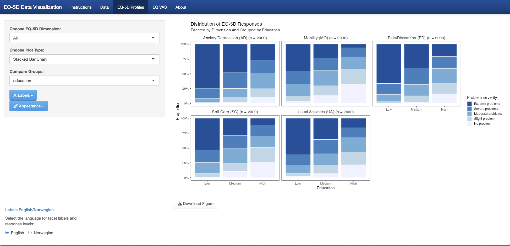
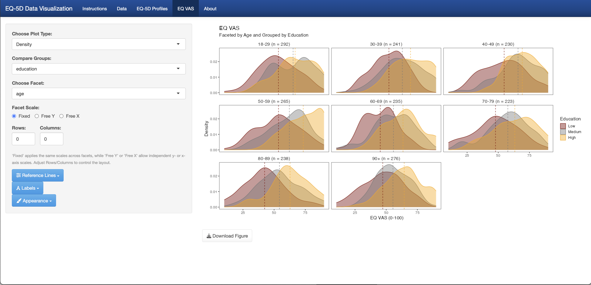

# Shiny.EQ5D

[](https://doi.org/10.5281/zenodo.15296115)
[](https://github.com/SondreNilsen/Shiny.EQ5D/actions/workflows/R-CMD-check.yaml)


An R package wrapping a Shiny application for interactive EQ-5D data visualization.

------------------------------------------------------------------------

## Table of Contents

-   [Description](#description)
-   [Installation](#installation)
-   [Usage](#usage)
-   [Web Application](#web--application)
-   [Features](#features)
-   [Screenshots](#screenshots)
-   [Citation](#citation)
-   [Dependencies](#dependencies)
-   [Issues & Feature Requests](#issues--feature-requests)
-   [Standalone R Script](#standalone-r-script)
-   [License](#license)

------------------------------------------------------------------------

## Description

**Shiny.EQ5D** provides an easy-to-install R package that launches a Shiny app for exploring and visualizing EQ-5D descriptive system and VAS (Visual Analogue Scale) data. Whether you’re working with built-in simulated data or your own clinical/research dataset, the app offers flexible plotting options, language toggles (English/Norwegian), and publication-quality downloadable figures.

------------------------------------------------------------------------

## Installation

Install the development version directly from GitHub:

``` r
install.packages("remotes")
remotes::install_github("SondreNilsen/Shiny.EQ5D")
```

### Installing on Offline or Closed Servers

If you're working on a server without access to GitHub (but with access to CRAN), you can still install the package from a `.tar.gz` source file.

-   Download the `Shiny.EQ5D_0.1.0.tar.gz` file from the [Releases page](https://github.com/SondreNilsen/Shiny.EQ5D/releases).
-   Install missing CRAN packages, if needed:

``` r
required_pkgs <- c(
  "shiny", "shinythemes", "shinyWidgets", "DT", "dplyr", "tidyr", "ggplot2",
  "ggpp", "ggrain", "ggsci", "ggthemes", "hrbrthemes", "RColorBrewer",
  "readr", "readxl", "scales", "viridis", "colourpicker", "haven"
)

missing <- setdiff(required_pkgs, rownames(installed.packages()))
if (length(missing)) install.packages(missing)
```

-   Install the local `.tar.gz` file *(adjust the path as needed)*:

``` r
install.packages("/path/to/Shiny.EQ5D_0.1.0.tar.gz", repos = NULL, type = "source")
```

------------------------------------------------------------------------

## Usage

Once installed, load the package and run the app with:

``` r
library(Shiny.EQ5D)
runEQ5DApp()
```

------------------------------------------------------------------------

## Web Application

You can also access and run the full Shiny.EQ5D application online (no data is ever stored):

🌐 [**https://sondrenilsen.shinyapps.io/ShinyEQ5D**](https://sondrenilsen.shinyapps.io/ShinyEQ5D)

> **Note:** All uploads in this hosted session are ephemeral—nothing is saved on the server.\
> For sensitive data or full control over your files, see [Usage](#usage) to install and run the app locally.

------------------------------------------------------------------------

## Features

### 🔍 Interactive Profiles View

-   Explore response distributions across all five EQ-5D dimensions
    (Mobility, Self-Care, Usual Activities, Pain/Discomfort, Anxiety/Depression)
-   Choose between bar, density, or stacked-bar charts
-   Facet by dimension and include per-facet sample sizes in strip labels

### 📊 EQ VAS View

Visualize overall health ratings (0–100) with:
- Histogram
- Density plot
- Raincloud plot
- Boxplot
- Violin plot
- Trend-line (observed, lm, loess)
- Add reference lines (mean/median) globally or by group
- Facet by any categorical variable with customizable scales

### 🎨 Theming & Localization

-   Select from multiple ggplot2 themes and color palettes (qualitative & sequential)
-   Toggle facet labels and response levels between English and Norwegian

### 📂 Data Upload & Preview

-   Import your own data in SPSS (.sav), Stata (.dta), Excel (.xls/.xlsx), or CSV formats\
-   Automatic wide-to-long conversion and factor labeling

### 📥 Download Publication-Quality Figures

-   One-click export to PDF or PNG at custom dimensions and resolution

------------------------------------------------------------------------

## Screenshots

- See a few example screenshots in the [`man/figures/`](man/figures/) folder.


<table>
<tr>
  <td align="center">
    <strong>EQ-5D Profiles</strong><br/>
    
  </td>
  <td align="center">
    <strong>EQ VAS</strong><br/>
    
  </td>
</tr>
</table>

------------------------------------------------------------------------

## Citation

If you use **Shiny.EQ5D** in your work, please cite it as:

> Nilsen, S. A. (2025). *Shiny.EQ5D: Interactive EQ-5D Data Visualizer* (Version 0.1.0) [Software]. Zenodo. <https://doi.org/10.5281/zenodo.15296115>

### BibTeX

``` bibtex
@Manual{Nilsen2025ShinyEQ5D,
  title     = {Shiny.EQ5D: Interactive EQ-5D Data Visualizer},
  author    = {Nilsen, Sondre Aasen},
  year      = {2025},
  version   = {0.1.0},
  doi       = {10.5281/zenodo.15296115},
  url       = {https://github.com/SondreNilsen/Shiny.EQ5D},
  note      = {Zenodo. https://doi.org/10.5281/zenodo.15296115}
}
```

You can also get this citation straight from R:

```r
citation("Shiny.EQ5D")
```

------------------------------------------------------------------------

## Dependencies

The package imports these core R packages: shiny, shinythemes, shinyWidgets, ggplot2, ggpp, hrbrthemes, ggthemes, ggsci, RColorBrewer, viridis, dplyr, tidyr, scales, DT, colourpicker, haven, readxl, readr, ggrain

------------------------------------------------------------------------

## Issues & Feature Requests

If you encounter a bug or would like to request a new feature, please open an issue on GitHub:

1.  Go to the [Issues tab of this repository](https://github.com/SondreNilsen/Shiny.EQ5D/issues)
2.  Click **New issue**
3.  Choose “Bug report” or “Feature request,” fill in the template, and submit

------------------------------------------------------------------------


## Standalone R Script

If you prefer working directly in R, you can use a standalone script to create many of the same plots available in the Shiny app.

📄 **Download the script:**  
[`EQ5D_script.R`](https://github.com/SondreNilsen/Shiny.EQ5D/blob/main/extras/EQ5D_script.R)

📖 **View the interactive user manual:**  
📄[`EQ5D_user_manual.html`](https://sondrenilsen.github.io/Shiny.EQ5D/EQ5D_user_manual.html)


------------------------------------------------------------------------


## License

This project is licensed under the **MIT License** – see the [LICENSE](LICENSE) file for details.

 > We welcome free use, modification, and contributions.  
 > If you’d like to incorporate this software into a commercial product or service, please [get in touch](mailto:sondre.aa.nilsen@gmail.com).

------------------------------------------------------------------------

*Created by Sondre Aasen Nilsen, on behalf of the Center for Patient-Reported Data, Haukeland University Hospital*
